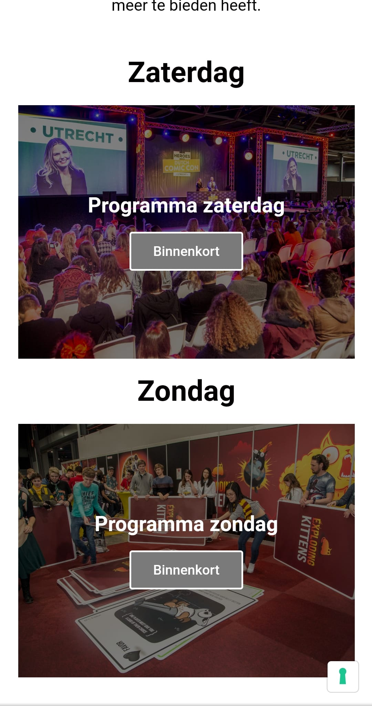
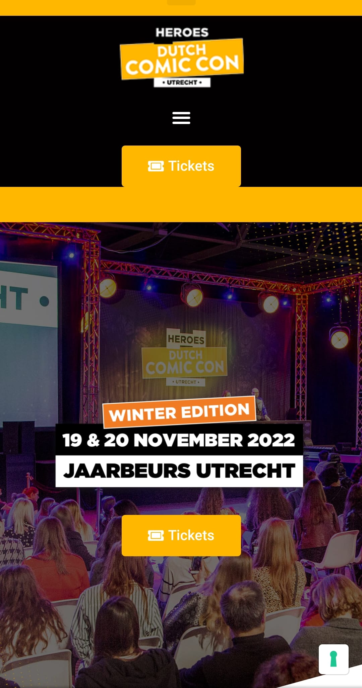
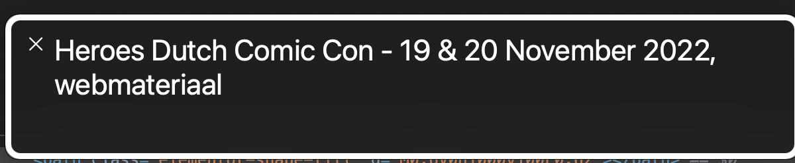
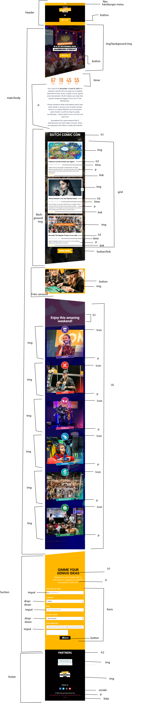
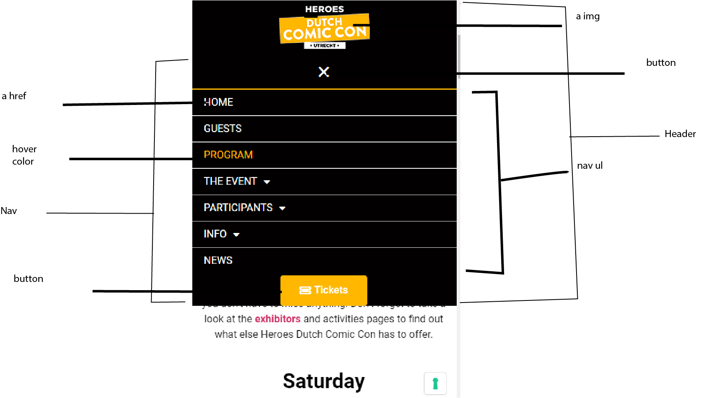

# Procesverslag
Markdown is een simpele manier om HTML te schrijven.  
Markdown cheat cheet: [Hulp bij het schrijven van Markdown](https://github.com/adam-p/markdown-here/wiki/Markdown-Cheatsheet).

Nb. De standaardstructuur en de spartaanse opmaak van de README.md zijn helemaal prima. Het gaat om de inhoud van je procesverslag. Besteedt de tijd voor pracht en praal aan je website.

Nb. Door *open* toe te voegen aan een *details* element kun je deze standaard open zetten. Fijn om dat steeds voor de relevante stuk(ken) te doen.

## Jij

  
uitwerken voor kick-off werkgroep

  ### Auteur:
  Mohihi Ramtahalsing

  #### Je startniveau:
  blauw

  #### Je focus:
   surface plane
 

## Je website

  
uitwerken voor kick-off werkgroep

  ### Je opdracht:
  Ik ga de website van Dutch Comic Con namaken 

  #### Screenshot(s) van de eerste pagina (small screen): 
  De programma pagina
  

  #### Screenshot(s) van de tweede pagina (small screen):
  De Homepage
  
 

## Toegankelijkheidstest 1/2 (week 1)

  
uitwerken na test in 1e werkgroep

  ### Bevindingen
  Er is geen dark mode. Dus dat moet ook toegevoegd worden
Blurred vision en kleurencontrasten werkt wel gewoon goed 

  #### Screenreader
  Bij de screenreader waren de meeste problemen. Hij las sommige text niet voor. Je hoorde de screenreader bij de main text allen zeggen "webmateriaal" en verder niks anders. Dus alle tekst moet voorgelezen worden. Ook beschref het niet de afbeeldingen. Het zei alleen maar 'afbeelding'
  

  #### Muis en Toetsenbord 
  Het gebruik met alleen een toetsenbord ging zonder fouten. Misschien kan ik de focus state iets duidelijker maken.
  Met muis is de site ook goed navigeerbaar. 

  #### Motoriek (shocks, elastiekjes)
  Met de elastiekjes had ik geen probleem. 
  Met de shocks was het wat lastiger, omdat scrollen met het touchpad gewoon niet te doen was. Het navigeren met tab is daarvoor een betere optie. Die kan ik nog beter maken door het duidelijker maken van de afbeeldingen die links zijn 

  #### Visueel (brillen, contrast, kleurenblind, dark/light). 
  Ik zie met een blurry bril best weinig, dit kan ik oplossen door een functie toe te voegen waarbij de de grootte van de tekst aan kan passen. Of de text iets groter te maken. 
  Met de kleurencontrasten had ik geen probleem
  Misschien bij de footer de wit op geel aanpassen om een iets beter contrast te krijgen

## Breakdownschets (week 1)

  
uitwerken na afloop 2e werkgroep

  ### de hele pagina: 
  

  ### dynamisch deel (bijv menu): 
  

 

## Voortgang 1 (week 2)

  
uitwerken voor 1e voortgang

  ### Stand van zaken
  Voor het eerste gesprek was ik veel bezig met het opzetten van mijn html en heb ik een begin gemaakt aan mijn css. Deze week ging veel beter dan ik origineel had verwacht. Ik liep niet tegen veel issues aan (ook omdat ik nog niet zo ontzettend veel had. Maar ik heb mezelf wel verbaasd over hoe goed het ging met coderen. Ik merk wel echt dat ik er steeds beter in word.

  ### Agenda voor meeting
  samen met je groepje opstellen

  | Mohini         | Laura              | Idelene      | Shanine          |
  | ---            | ---                | ---          | ---              |
  | Hamburgermenu  | Animatie           | Positionering| Wanneer wel classes   |
  | Stijlen forms  | Hoe zit het met de 2e pagina | ALt labels   | Element dat verschuift als je scrolled|
  | ...            | ...                | ...          | ...              |

  ### Verslag van meeting

  - Hoe maak je een hamburger menu (1 of 2 buttons)
  - Posistionering met behulp van een grid
  - Animatie like button
  - ...

## Voortgang 2 (week 3)

  
uitwerken voor 2e voortgang

  ### Stand van zaken
  hier dit ging goed & dit was lastig (neem ook screenshots op van delen van je website en code)

  ### Agenda voor meeting
  samen met je groepje opstellen

  | Mohini        | Deniz      | Donna    | Shanine        |
  | ---            | ---                | ---          | ---              |
  | Hoe style ik forms?  | Vraag. Hoe zet ik een background image bij mijn header?          | Mag je een ID gebruiken zodat je maar 1 css pagina hebt?    |Hoe maak ik de cirkel bovenin? |
  | Waarom werkt mijn AddEventListener niet? | Hoe zet ik content in een bepaalde volgorde? |Hoe doe ik deze transitions? | Hoe zet je een filmpje bij de header? |
  | Hoe voeg je een countdown timer?  | Hoe zet ik mijn buttons naast elkaar met een img ertussen?  | Mag ik deze ID houden? | .. |
  |...  | Waarom werkt me font niet? |  Mogen px bij media schermbreedte? | ...|
  | ...            | ...                | ...          | ...              |

  ### Verslag van meeting

  - Mijn script link stond op de verkeerde plek.
  - Form is correct gestijld
  - Countdown is te lastig
- ...

## Toegankelijkheidstest 2/2 (week 4)

  
uitwerken na test in 8e werkgroep

  ### Bevindingen
  Mijn Focus op de Form onder aan het scherm werkt niet
  Tekst kan nog wat groter

  #### Screenreader
 Alle content en afbeeldingen werden goed door de screenreader gelezen

  #### Muis en Toetsenbord 
 Makkelijk doorheen te scrollen. 
  Met behulp van de tab kun je makkelijk zien waar je bent door de felle focus kleur. Alleen werkt de focus niet op mijn form.

  #### Motoriek (shocks, elastiekjes)
  De site was makkelijk te navigeren met de elastiekjes.
  De shocks gingen wat lastiger maar door een combinatie van scrollen en tab gebruiken is het toch makkelijk te navigeren

  #### Visueel (brillen, contrast, kleurenblind, dark/light). 
  Met alle contrast brillen ik alle content goed zien. 
  Ik had wel moeite met de vierkante blurry bril, dus daarom kan de tekst wat groter.
  Met alle kleurenblind testen kwam ik tegen geen problemen aan. 
  Ik heb nog geen dark mode, die ga ik nog toevoegen
  

## Voortgang 3 (week 4)

  
uitwerken voor 3e voortgang

  ### Stand van zaken
  Het ging eerlijk gezegd minder goed dan afgelopen weken. Ik heb heel veel verschillende dingen geprobeerd die niet echt werkte, dus ik heb een heleboel tijd verspild Ik heb wel voldoende vragen voor het voortgangsgesprek, dus dat is fijn.

  ### Agenda voor meeting
  samen met je groepje opstellen

  | Mohini | Laura     | Shanine    | Idelene         |
  | ---            | ---                | ---          | ---              |
  | Menu openklappen|Java animatie      | Hoe maak je een tabel? | Object ovserver api werkt niet|
  | Schuine randen | ..| ...  | ... |
  | ...            | ...                | ...          | ...              |

  ### Verslag van meeting
  Ik werdt snel geholpen met mijn vraag over het hamburger menu

  - Hamburger menu opgelost met origin
  - Javascript gefixt
  - Schuine randen kwamen we niet aan toe
  - ...

## Eindgesprek (week 5)

  
uitwerken voor eindgesprek

  ### Je uitkomst - karakteristiek screenshots:
  

  ### Dit ging goed/Heb ik geleerd: 
  Korte omschrijving met plaatjes

  

  ### Dit was lastig/Is niet gelukt:
  Korte omschrijving met plaatjes

  

## Bronnenlijst

  
continu bijhouden terwijl je werkt

  Nb. Wees specifiek ('css-tricks' als bron is bijv. niet specifiek genoeg).

  1. [bron 1](https://dlo.mijnhva.nl/d2l/common/dialogs/quickLink/quickLink.d2l?ou=437097&type=coursefile&fileId=FED+22-23+-+Blok+1+-+inh02+-+Werkgroep+1.pdf)
  2. [bron 2](https://www.w3schools.com/howto/howto_css_animate_buttons.asp)
  3. https://www.w3schools.com/css/css_form.asp
	4. https://www.w3schools.com/howto/howto_css_button_on_image.asp
	5.https://www.w3schools.com/howto/howto_js_topnav.asp
	6. Hulp gekregen van andere studenten (Leo Kramer, Donna Stam en Timo)
	7. Studentenassistenten
	8. De codepens van Sanne (in Teams)
	9. Hulpmiddelen op DLO

